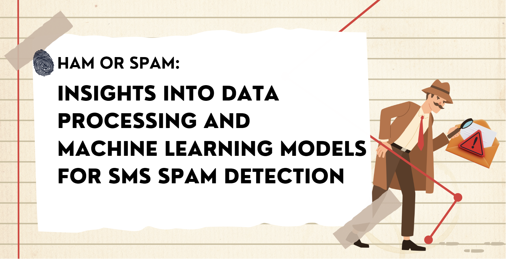
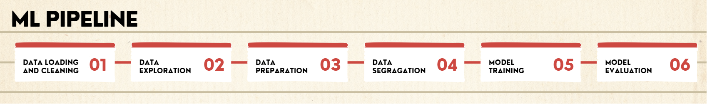

<h1>Project Description</h1>
For my MSDS Machine Learning 1 project, I developed a Multinomial Naive Bayes model for SMS spam text classification. The model achieved 98% test accuracy and 93% F1 score by leveraging techniques like Count Vectorizer and TF-IDF for text data preprocessing.

<h2>Highlights</h2>
- The Multinomial Naive-Bayes model demonstrated its advantage on highly sparse data as compared to our ML1 models.
- SMS Spam text classification was the chosen use case with results showing better accuracy and speed.
- We used and compared two options to vectorize our text data: Count Vectorizer and TFIDF Vectorizer.
- We introduced the Natural Language Toolkit (NLTK) library for symbolic and statistical natural language processing (NLP).
- Our model achieved a test accuracy of ~98% and an F1 score of ~93%.

<h2>Methodology</h2>

<h2>Author</h2>
John Cris Orenday

<h2>References</h2>
1. Aggarwal, C. (2015). *Data Mining: The Textbook.*

2. Alis, C. (2023). Information Retrieval and Searching by Similarity. Unpublished Jupyter Notebook, Data Mining and Wrangling 1 (DMW1) Course, Master of Science in Data Science, Asian Institute of Management, Makati City,  Philippines.

3. Kharwal, A. (2020, June 12). SMS Spam Detection with Machine Learning. The Clever Programmer. Retrieved from https://thecleverprogrammer.com/2020/06/12/sms-spam-detection-with-machine-learning/

4. Monterola, C. (2023). Machine Learning 1. Unpublished Jupyter Notebooks, Machine Learning 1 (ML1) Course, Master of Science in Data Science, Asian Institute of Management, Makati City,  Philippines.

5. Müller, A. C., & Guido, S. (2017). *Introduction to Machine Learning with Python.* O'Reilly Media.

6. PhilStar. (2010, June 20). New Text Scam Victimizing OFWs? Retrieved from https://www.philstar.com/metro/2010/06/20/585578/new-text-scam-victimizing-ofws

7. scikit-learn developers. (n.d.). scikit-learn: Machine learning in Python. Retrieved from https://scikit-learn.org/stable/index.html

8. Stat Quest with Josh Starmer. (2020). Naive Bayes, Clearly Explained!!! [Video]. YouTube. Retrieved from https://www.youtube.com/watch?v=O2L2Uv9pdDA&t=85s

9. Statista. (2019). Number of SMS fraud or text scams incidents in the Philippines in 2019, by region. Retrieved from https://www.statista.com/statistics/1136130/philippines-number-of-sms-fraud-or-text-scams-incidents-by-region/

10. UCI Machine Learning. (2016). SMS Spam Collection Dataset. Kaggle. Retrieved from https://www.kaggle.com/datasets/uciml/sms-spam-collection-dataset/data
